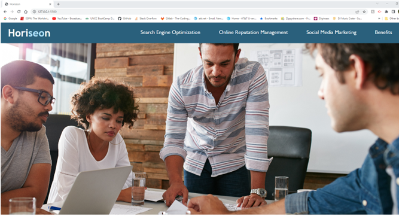
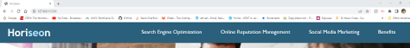
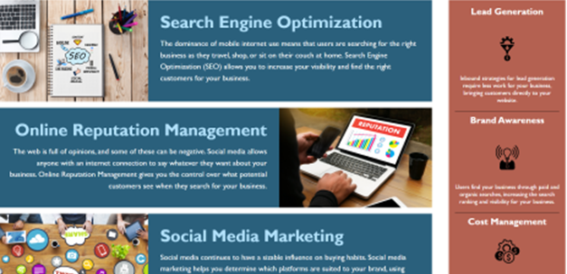

# html-css-challenge-one


Refactor an existing website to implement the following user story:
 
 * As a marketing agency, I want a codebase that follows accessibility Standards, so that our own site is optimized for search engines.

## Acceptance Criteria

```
GIVEN a webpage that meets accessibility standards
WHEN I view the source code
THEN I find semantic HTML elements
WHEN I view the structure of the HTML elements
THEN I find that the elements follow a logical structure independent of styling and positioning
WHEN I view the icon and image elements
THEN I find accessible alt attributes
WHEN I view the heading attributes
THEN I find that they fall in sequential order
WHEN I view the title element
THEN I find a concise, descriptive title
```

## My Criteria 

* Want to refactor a website for a marketing agency to allow accessibility standards, and provide opitmization for search engines. 

    The Horiseon website consists basic information for the customer to make your company marketable through the world wide web. Also providing information on search-engine best practices, social media marketing, online reputation and the benefits of it all.
    

##  Consists of

* Adding semantic HTML code to make code more readable to the developer.

* Restructing the code for better flow.

* Image elements with accessibiliy attribtes such as "alt".

* Semantic heading attributes.  

* Restructure of the color scheme making the site more appealing to the eye

* Logical Structure and positioning 

* <a> links to access different areas of the page or other sites 

* Standard accessbility semantics 


## Website 

    https://github.com/MichaelZimm20/html-css-challenge-one

    https://michaelzimm20.github.io/Horiseon-refactor-challenge-one/
    


## Git

To view the latest source of the GIT server in VS code do this:

        git clone git@github.com:MichaelZimm20/html-css-challenge-one.git

## Website Screenshots 

 
<br/><br/><br/>


<br/><br/>

 
<br/><br/>

 
